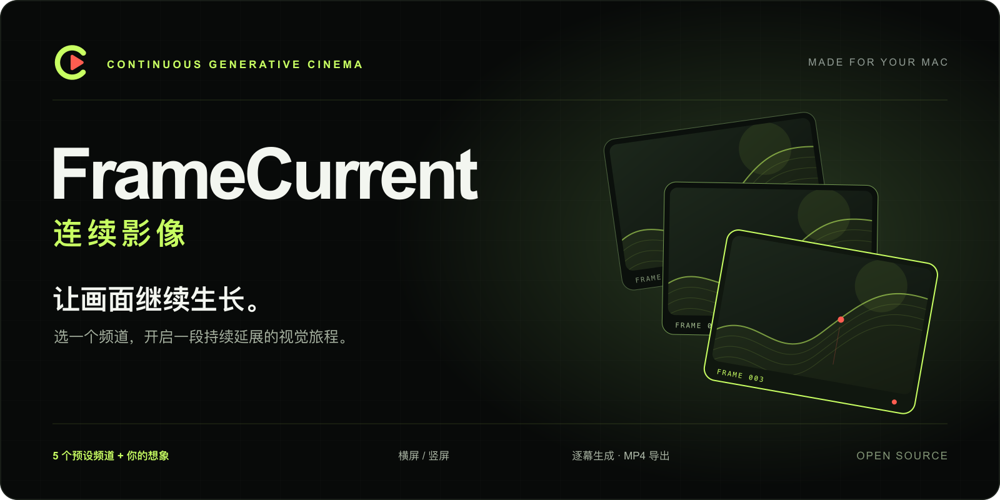
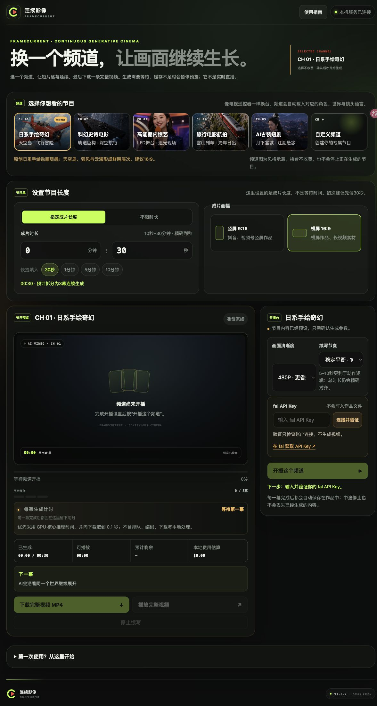
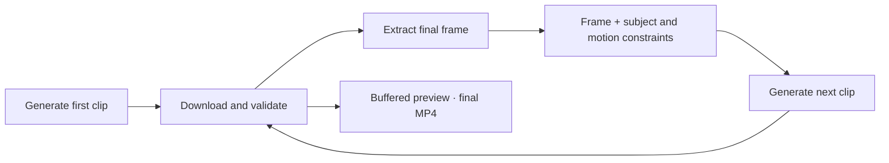

<p align="center">
  
</p>

<h1 align="center">FrameCurrent · 连续影像</h1>
<p align="center"><strong>Choose a channel. Let the next frame take you further.</strong><br>Generate, preview and export a longer visual journey on your Mac.</p>

<p align="center"><a href="README.md">简体中文</a> · <a href="#get-started">Get started</a> · <a href="#the-channels">Channels</a> · <a href="docs/QUICKSTART.md">Detailed guide · 中文</a></p>
<p align="center">
  <a href="https://github.com/Grace-Omni/framecurrent/actions/workflows/ci.yml"></a>
  <a href="LICENSE"></a>
  <a href="CHANGELOG.md"></a>
</p>

FrameCurrent turns short AI generations into a continuous creation workflow. Pick a channel and an output length; the app generates successive clips, previews them as the buffer fills, and merges the finished programme into an MP4 you can use in your next edit.

> **Before starting:** this is an experimental macOS app. Bring your own fal API Key and balance; generation costs real money after confirmation. Generation takes time, and motion or spatial continuity still needs a full playback review. The repository is currently private for invited reviewers.

<table>
<tr>
<td width="33%" valign="top"><h3>Choose a world</h3><p>Five preset channels keep creative controls out of the way. The custom channel lets you define the subject, world, camera and optional reference frame.</p></td>
<td width="33%" valign="top"><h3>Set your format</h3><p>Landscape or portrait, 10 seconds to 30 minutes, or continue until you stop or reach a local estimated-cost cap.</p></td>
<td width="33%" valign="top"><h3>Take it into your edit</h3><p>Buffered previews, a finished MP4 and individually downloadable saved clips, including after an interruption.</p></td>
</tr>
</table>

## The channels


<sub>Channel concept artwork, not generated-video evidence or a quality guarantee.</sub>

| Channel | A world to explore |
| :--- | :--- |
| **01 · Hand-drawn fantasy** | Red glider, floating islands, windmills and a sea of clouds |
| **02 · Cinematic sci-fi** | Deep-space scout, eclipsed planet and orbital megastructures |
| **03 · Studio variety** | A single host, circular stage and expressive LED lighting |
| **04 · Aerial travel** | Scenic train, mountain peaks, lakes and coastline |
| **05 · Chinese costume drama** | A heroine moving through a moonlit palace skyline |
| **＋ · Your own channel** | Your subject, setting, action, camera and visual direction |

Presets fix the creative direction, not the exact output. The drama and variety channels are visual presets, rather than complete scripts, multi-person dialogue or programme planning.

## Inside the app

Channel selection, output settings, a player and a compact control desk. Only the custom channel expands the creative settings.

<details>
<summary><strong>View the full running interface ↗</strong></summary>
<br>
<a href="docs/brand/app-overview.png"></a>

Captured from a fresh local 1.6.2 session with no Key and no generation submitted. This is the real interface, not generated video.

</details>

## Get started

### 1 · Choose how to connect

**Run on your Mac:** prepare Python 3.9+, Apple Command Line Tools and the system media utilities. Apple Silicon and Intel Macs follow the same launch steps; `doctor.command` checks the local dependencies.

**Connect from Windows / Linux:** run FrameCurrent on your own Mac, then use an SSH connection to access it in your Windows or Linux browser. Media processing and stored projects stay on the Mac; see the expandable instructions below.

If Apple Command Line Tools are missing:

```bash
xcode-select --install
```

The first installation and compilation can take time. Everyday use does not require Node.js, Docker or a frontend build.

### 2 · Download and launch on the Mac

Use **Code → Download ZIP**, fully extract it, then double-click `doctor.command` and `run.command`. Or use Git:

```bash
git clone https://github.com/Grace-Omni/framecurrent.git
cd framecurrent
./doctor.command
./run.command
```

Repository access is required during private review. If the scripts lack executable permission, run `chmod +x run.command doctor.command` in the extracted folder.

Your browser opens `http://127.0.0.1:4173`. Keep the terminal open while using the app. On subsequent visits, run `run.command` again; a matching existing instance will reopen.

<details>
<summary><strong>Windows / Linux: connect to your Mac</strong></summary>

Launch FrameCurrent on the Mac using the steps above, then enable [Remote Login](https://support.apple.com/guide/mac-help/allow-a-remote-computer-to-access-your-mac-mchlp1066/mac) for your own account. Both devices need to be reachable over your local network or private VPN.

In Windows Terminal (PowerShell) or a Linux terminal, replace `USER` and `MAC_ADDRESS` with the Mac account name and network address:

```bash
ssh -N -o ExitOnForwardFailure=yes -L 127.0.0.1:4173:127.0.0.1:4173 USER@MAC_ADDRESS
```

Keep the SSH terminal open and visit `http://127.0.0.1:4173` in your browser. If Windows cannot find `ssh`, install the [OpenSSH client](https://learn.microsoft.com/en-us/windows-server/administration/openssh/openssh_install_firstuse).

This connects to your Mac-hosted instance; Python and media tools are only needed on the Mac. Keep the Mac awake, allow only your own account to connect, and leave the app bound to loopback. Port 4173 must be free on the client; keep both ends on the same port. Before switching devices with a running generation, stop and save it in the original browser. This is a personal workspace, not a shared multi-user service.

</details>

### 3 · Make a 30-second sample

**Select a channel → keep 30s / 480P → verify your Key → review the estimate → confirm → preview and download.**

Get a Key from the [fal dashboard](https://fal.ai/dashboard/keys). Connection checks do not submit a video. The confirmation dialog shows the channel, output length, format and estimated cost.

Thirty seconds is the output length, not the wait time. Review a short sample before increasing duration. Before closing the terminal, stop generation and save your clips.

## How a scene continues



The next clip starts from the previous final frame and repeats subject, setting and movement constraints. This can reduce visible boundary jumps, but independent model calls may still drift or produce inconsistent motion and space. Slow motion, one subject and a stable camera are good starting points.

<details>
<summary><strong>Specifications and practical limits</strong></summary>

| Item | Current support |
| :--- | :--- |
| Provider | MiniMax H3 Max through fal |
| Output length | 10s–30min, or continue until stopped / local estimated-cost cap |
| Format | 16:9 or 9:16; 480P or 768P |
| Clip rhythm | Choose 5s, 10s or 15s; the schedule adjusts to the target length |
| Output | Buffered preview, H.264 + AAC MP4 on completion, saved-clip downloads |
| Concurrency | One generation task; channel changes do not start or stop jobs |
| Stop and cost | Stops further submissions; an already-submitted clip may still incur a charge |
| Unlimited mode | A local estimate cap is required, up to $150; this is not a fal billing guarantee |
| Storage | Media in local `runtime/sessions/`; Keys in page/process memory |
| Deployment | Single-user macOS app; no public multi-user authentication or isolation |

Per-clip timing includes its source. GPU inference excludes queueing, encoding, downloading and local processing. It is not total wait time. See [verification and timing](docs/VERIFICATION.md).

</details>

## Questions, contribution and documentation

- **No Key yet?** Explore the channels and edit settings; generation requires your own Key and balance.
- **Page unavailable?** Run `run.command` and keep its terminal open. Use `doctor.command` to diagnose environment issues.
- **Generation interrupted?** Retrieve completed clips from the saved-clips section. A partial fixed-length task may not have a merged MP4.
- **Switching channels?** The original job continues. Use the running-channel notice to return to it.

Feedback and contributions are welcome: [Issues](https://github.com/Grace-Omni/framecurrent/issues) · [Contributing](CONTRIBUTING.md) · [Changelog](CHANGELOG.md).

Explore the [architecture](docs/ARCHITECTURE.md), [verification record](docs/VERIFICATION.md), [privacy](PRIVACY.md), [security reporting](SECURITY.md), [brand guide](docs/BRAND.md) and [asset register](ASSETS.md).

## License

Source, documentation and included assets listed in [ASSETS.md](ASSETS.md) are under **[Apache-2.0](LICENSE)**. Trademark rights in “连续影像”, “FrameCurrent” and associated logos remain reserved; derivative products should use a distinct identity. See [NOTICE](NOTICE) and [TRADEMARKS.md](TRADEMARKS.md).

<p align="center"><br><strong>Frame by frame. Let the story flow.</strong><br><sub>连续影像 · FrameCurrent</sub></p>
