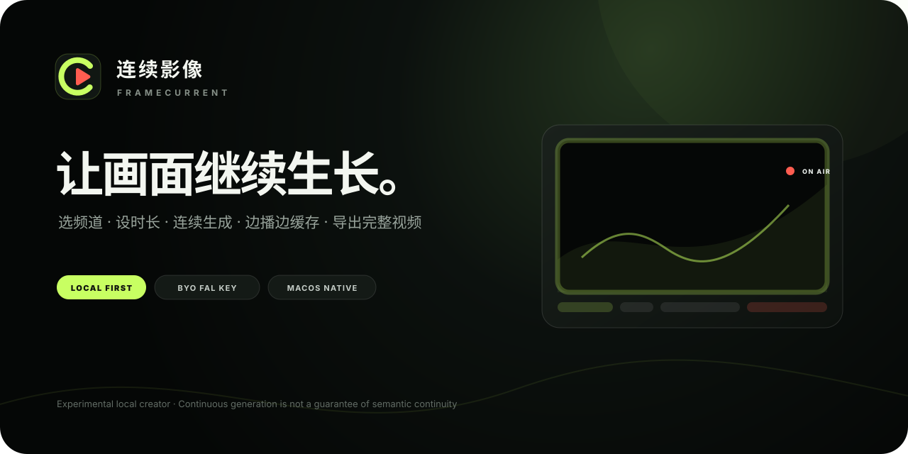

<h1 align="center">连续影像 · FrameCurrent</h1>

<p align="center">
  
</p>

<p align="center"><strong>像换电视频道一样，持续生成、观看并导出 AI 视频。</strong></p>

<p align="center">
  
  
  
  
  
</p>

<p align="center">
  
</p>

> [!WARNING]
> 当前 1.6.1 版本是 **macOS 本机实验版**，使用你自己的 fal API Key，并会在确认后产生真实生成费用。它不是公共 SaaS，也不应直接暴露到公网。

## 它是什么

连续影像（**FrameCurrent**）把短片段视频模型包装成一台 AI 电视：选择频道和观看时长后，软件会逐幕生成、预先缓存、连续播放，并在结束时合并为一条完整 MP4。

它解决的是“持续创作与观看”的工作流，不是把模型能力夸大成真正的逐帧实时直播。上一幕末帧可以帮助下一幕在接缝处对上，但动作阶段、空间关系和因果逻辑仍需要完整观看验收。

## 现在能做什么

- 五个视觉差异明显的预设频道：日系手绘奇幻、科幻史诗电影、高能棚内综艺、旅行电影航拍、AI 古装短剧。
- 一个自定义频道：只有选择“自定义频道”时才显示完整节目设置；预设频道只保留开播参数。
- 定时模式支持 **10 秒到 30 分钟**自由输入，精确到秒。
- 不限时模式持续生成，直到手动停播或达到本地预计费用上限。
- 支持 **16:9 横屏**与 **9:16 竖屏**。
- 支持 480P / 768P、5 / 10 / 15 秒续写节奏和可选首帧参考。
- 至少两幕准备完成后开始边生成、边缓存、边预览。
- 自动提取末帧、验证媒体、裁齐时长并合并 H.264 + AAC MP4。
- 每幕记录带来源的生成计时；优先使用 GPU 核心推理指标，缺失时明确降级到 fal processing 或本机 result-ready 观测值。
- 每个频道独立保留会话；换台不会自动发起付费任务。
- 付费启动使用幂等请求 ID，降低网络结果不确定时重复创建任务的风险。

## 安装与 60 秒启动

要求：一台 Mac，Python 3、Swift 编译器与 AVFoundation 工具。若缺少 Swift，请先运行 `xcode-select --install` 安装 Apple 命令行工具。Node.js 只用于贡献者检查 JavaScript，不是软件运行依赖。

从 GitHub 获取源码后，可以克隆仓库，也可以点击 **Code → Download ZIP**；ZIP 下载后必须先完整解压，再执行下面步骤。

1. 双击 `doctor.command` 检查运行环境。
2. 双击 `run.command`。
3. 浏览器会打开 `http://127.0.0.1:4173`。
4. 选择频道、时长、画幅和清晰度。
5. 输入并验证 fal API Key，点击开播后在付费确认弹窗中核对费用。

也可以在终端运行：

```bash
/usr/bin/python3 app.py
```

服务默认只监听 `127.0.0.1`。使用期间请保持终端窗口开启，按 `Control-C` 停止。

## 两种频道体验

| 频道类型 | 用户看到的界面 | 内容来源 |
|---|---|---|
| 五个预设频道 | 观看方式、画幅、清晰度、续写节奏与 Key | 已锁定的主体、世界、动作、镜头和排除项 |
| 自定义频道 | 上述开播参数 + “节目设置” | 用户定义频道名、视觉类型、主体、世界、动作、镜头、排除项和首帧参考 |

预设频道的创作字段仍作为内部锁定参数提交，但不再用一整块表单打扰观看者。自定义频道的首帧参考不会暗中影响其他预设频道。

## 连续性策略

```text
首幕文生视频 / 参考图生视频
          ↓
下载并验证当前片段
          ↓
提取当前末帧 + 继承约束
          ↓
生成下一幕并进入播放缓冲
          ↓
裁齐各幕音视频 → 合并完整 MP4
```

软件同时使用四层控制：

1. **视觉锁定**：每幕重复主体外形、材质、颜色、场景、光线和镜头方向。
2. **状态接力**：下一幕从上一幕最后一帧开始，而不是重新文生视频。
3. **动作约束**：续写提示强调继承当前构图与运动，避免旧地标回到前方、碰撞穿模和遮挡式重置。
4. **媒体验收**：验证时长、比例、编码、音轨、文件大小与最终 SHA-256。

这能减少硬切和身份突变，但不能让独立模型调用共享真实的三维世界状态。发布前仍应完整播放检查。

## 费用与安全边界

- API Key 只存在于当前页面和 Python 进程内存，启动任务后页面会清空输入。
- 费用确认不常驻占用创作表单；每次点击开播才出现一次确认弹窗。固定时长自动采用本地预计费用，不限时模式要求临时输入本地预计费用上限，单次最高为 **$150**。
- 页面使用内置标准费率做本地门禁；确认后的请求仍提交 `paid_confirmed: true` 和本地上限，后端继续独立校验。它不是 fal 的账单硬上限，模型促销与最终账单以 fal 当时页面和账户为准。
- 每提交一幕前再次检查预算；停播只阻止后续提交，已经提交的一幕仍可能完成并计费。
- 外部 fal 请求不会自动跟随重定向，避免认证信息被转发；本机服务只允许监听 `127.0.0.1`，并校验请求 Host、Origin 与 JSON 类型。
- “GPU 核心推理”不含排队、编码、下载和本地处理；本机 result-ready 降级值则包含排队、网络、轮询与结果读取。所有计时都必须连同来源理解，不是 MiniMax 或 fal 的官方速度承诺。
- fal 请求带有不持久化输入/输出的请求头，但这是给服务商的处理指令，不应理解为绝对隐私保证。
- 频道草稿与会话标识会保存在浏览器本地存储；视频、首尾帧和任务清单会保存在本机 `runtime/sessions/`。

详细说明见 [PRIVACY.md](PRIVACY.md) 与 [SECURITY.md](SECURITY.md)。

## 技术结构

| 路径 | 作用 |
|---|---|
| `app.py` | 本地 HTTP 服务、fal 队列、预算、会话、媒体校验和下载 |
| `web/` | AI 电视台界面、实时预览和完整作品播放器 |
| `scripts/` | AVFoundation 首尾帧提取、接缝诊断和 MP4 合并 |
| `tests/` | 完全离线的服务端、安全与媒体流程测试 |
| `runtime/` | 本机生成作品与编译工具；已从 Git 排除 |
| `real-test/` | 本机历史付费验收素材；已从 Git 排除 |

进一步阅读：[架构](docs/ARCHITECTURE.md) · [当前验证](docs/VERIFICATION.md) · [品牌规范](docs/BRAND.md) · [发布清单](docs/PUBLISHING_CHECKLIST.md)

## 验证

```bash
/usr/bin/python3 -m unittest discover -s tests -v
```

当前 1.6.1 验证基线：**71 / 71 PASS**。自动测试使用本地替身，不连接 fal，也不会提交付费视频任务；计时测试只验证字段解析、来源优先级、向下截取和公开状态，不是远端性能基准。完整范围见 [当前验证](docs/VERIFICATION.md)。

JavaScript 语法检查：

```bash
node --check web/app.js
node --check web/player.js
```

GitHub Actions 只运行离线测试、Swift 编译检查、静态检查与本机健康端点，不配置 fal 密钥。

## 兼容性

已验证环境为 macOS、Apple Silicon、系统 Python、Swift 6、AVFoundation 与 `/usr/bin/avmediainfo`。当前实现硬依赖 Apple 媒体框架，因此不宣称支持 Windows 或 Linux。

如果 GitHub 下载的 `.command` 文件无法双击，先右键选择“打开”，或在终端执行：

```bash
chmod +x run.command doctor.command
./doctor.command
./run.command
```

## 准备发布到 GitHub

只把本目录作为仓库根，不要把上层工作目录一起发布。提交前运行 [发布清单](docs/PUBLISHING_CHECKLIST.md)，尤其确认：

- `runtime/`、`real-test/`、生成视频、manifest 和预编译二进制没有进入 Git。
- 没有 API Key、参考图、私人 prompt 或媒体回执。
- Apache-2.0、现有仓库图片的公开授权和商标保留说明均保持完整。

## 许可证与商标

FrameCurrent 目前处于实验阶段。源码、文档，以及 [ASSETS.md](ASSETS.md)
中标记为 **Include** 的现有 Logo、仓库品牌图和频道图，均按
[Apache License 2.0](LICENSE) 发布，可依照许可证复制、修改与分发。

“连续影像”、“FrameCurrent”及其关联的生产 Logo 所承载的商标权仍由
项目所有者保留。Apache-2.0 第 6 条不授予把这些名称或 Logo 用作另一个
产品品牌、暗示官方身份或背书的权利。仓库副本可以为说明来源保留原始
Logo；公开分发的衍生产品应采用不同的主名称和视觉身份。详见
[TRADEMARKS.md](TRADEMARKS.md) 与 [NOTICE](NOTICE)。

本项目与 MiniMax、fal、Apple 均无官方隶属或背书关系。第三方名称仅用于说明兼容性。

## 参与贡献

开始前请阅读 [CONTRIBUTING.md](CONTRIBUTING.md)。漏洞与密钥问题请按 [SECURITY.md](SECURITY.md) 私下报告，不要发到公开 Issue。
