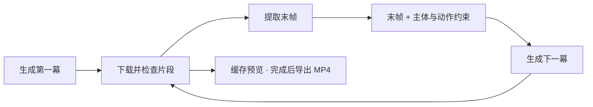

<p align="center">
  
</p>

<h1 align="center">连续影像 · FrameCurrent</h1>
<p align="center"><strong>像换频道一样选择灵感，让 AI 把画面逐幕延续。</strong><br>在 Mac 上生成、预览，并导出属于你的完整视频。</p>

<p align="center">
  <a href="#开始使用">开始使用</a> ·
  <a href="#频道一览">探索频道</a> ·
  <a href="#界面实览">界面实览</a> ·
  <a href="docs/QUICKSTART.md">使用指南</a> ·
  <a href="README.en.md">English</a>
</p>

<p align="center">
  <a href="https://github.com/Grace-Omni/framecurrent/actions/workflows/ci.yml"></a>
  
  <a href="LICENSE"></a>
  <a href="CHANGELOG.md"></a>
</p>

连续影像把短片段生成模型组织成一台 **AI 创作电视**：选频道、设定成片长度，软件会串联生成、缓存预览，并在完成后合成 MP4。你可以用它探索动画世界、科幻场景与电影感素材，再把成片放进自己的下一期作品。

> **使用前知道这三点：** 当前是 macOS 本机实验版；生成需要你自己的 fal API Key 和余额；按幕生成需要等待，长片的动作与空间逻辑仍需完整播放检查。

<table>
  <tr>
    <td width="33%" valign="top"><h3>一键进入一个世界</h3><p>五个预设频道直接开播。只在自定义频道展开主体、场景、镜头与首帧参考设置。</p></td>
    <td width="33%" valign="top"><h3>按作品决定长度</h3><p>10秒到30分钟自由输入，横屏或竖屏任选；不限时模式持续到停播或达到本地预计费用上限。</p></td>
    <td width="33%" valign="top"><h3>把灵感带进剪辑台</h3><p>生成时缓存预览，完成后下载 MP4。每幕自动保存，中途停止也能取回已完成片段。</p></td>
  </tr>
</table>

## 频道一览

<p>
  
</p>
<p><sub>01频道的横屏内置美术首帧，用于启动图生视频；不是生成视频样片或效果保证。</sub></p>

| 频道 | 你将进入的世界 | 适合探索 |
| :--- | :--- | :--- |
| **01 · 日系手绘奇幻** | 夏日花草地、草帽小女孩与橘白猫 | 治愈动画、奇幻发现 |
| **02 · 科幻史诗电影** | 时间勘探者、四季晶体与风暴峡谷 | 科幻视觉、未知探索 |
| **03 · 高能棚内综艺** | 女歌手、巨型机械月亮与黑红舞台 | 舞台表演、临场惊喜 |
| **04 · 旅行电影航拍** | 徒步者、火山山脊、海岸与翡翠湖 | 航拍感素材、旅途发现 |
| **05 · AI古装短剧** | 女将、边关城墙、落日沙暴与烽火 | 古装氛围、戏剧反转 |
| **＋ · 自定义频道** | 由你设定主体、世界、动作与镜头 | 原创概念、自己的视觉方向 |

频道固定视觉风格与初始世界，不预写整期剧情。所有时长均由 AI 结合上一幕画面逐幕即兴续写，推动新的事件与转折；指定时长会在结尾引导当前故事收束。古装与综艺频道暂不提供多人物对白或完整节目编排。

## 界面实览

**频道选择 → 节目长度 → 播放器与开播台。** 预设频道保持简洁，自定义频道展开创作设置；运行中的任务可以跨频道找回，已保存片段可单独下载。

播放器默认黑屏，点击“预览已生成视频”或“预览示例”才播放已有内容；关闭预览即可回到黑屏，不会删除视频或停止生成。新开播的节目仍会在缓存就绪后自动播放。

<details>
<summary><strong>展开查看完整运行界面 ↗</strong></summary>
<br>
<a href="docs/brand/app-overview.png"></a>

截图来自 **1.6.2 的全新本机会话**，未输入 Key、未提交生成。展示的是实际软件界面；点击图片可查看原图。

</details>

## 开始使用

### 1 · 选择使用方式

**Mac 本机启动**：准备 Python 3.9+、Apple 命令行工具与系统媒体组件。Apple Silicon 和 Intel Mac 使用同一套启动步骤，由 `doctor.command` 检查本机依赖。

**Windows / Linux 连接使用**：在自己的 Mac 上运行连续影像，通过 SSH 安全连接，在 Windows 或 Linux 浏览器中操作。媒体处理与作品保存在 Mac 端，连接步骤见下方折叠说明。

若尚未安装 Apple 命令行工具，在终端运行：

```bash
xcode-select --install
```

首次安装及媒体工具编译需要一些时间。日常使用无需 Node.js、Docker 或前端构建。

### 2 · 在 Mac 上下载并启动

在仓库右上方选择 **Code → Download ZIP**，完整解压后：

1. 双击 `doctor.command` 检查环境。
2. 双击 `run.command`，浏览器自动打开 `http://127.0.0.1:4173`。
3. 使用期间保持启动终端开启。下次使用只需再次打开 `run.command`。

<details>
<summary>习惯使用 Git？复制这四行</summary>

```bash
git clone https://github.com/Grace-Omni/framecurrent.git
cd framecurrent
./doctor.command
./run.command
```

私有审核期间，克隆或下载需要对应 GitHub 账户的仓库访问权限。`.command` 打不开时，参阅 [启动故障排查](docs/QUICKSTART.md#故障排查)。

</details>

<details>
<summary><strong>Windows / Linux：连接自己的 Mac 使用</strong></summary>

先在 Mac 上完成上述启动步骤，并为自己的账户开启 [远程登录](https://support.apple.com/guide/mac-help/allow-a-remote-computer-to-access-your-mac-mchlp1066/mac)。两台设备应处于可互访的局域网或私人 VPN 中。

在 Windows Terminal（PowerShell）或 Linux 终端中运行，将 `USER`、`MAC_ADDRESS` 替换为 Mac 用户名和网络地址：

```bash
ssh -N -o ExitOnForwardFailure=yes -L 127.0.0.1:4173:127.0.0.1:4173 USER@MAC_ADDRESS
```

保持连接终端开启，在当前电脑的浏览器打开 `http://127.0.0.1:4173`。Windows 若找不到 `ssh`，先安装 [OpenSSH 客户端](https://learn.microsoft.com/en-us/windows-server/administration/openssh/openssh_install_firstuse)。

这是连接 Mac 端运行实例的方式，无需在 Windows / Linux 上安装 Python 或媒体工具。更多连接设置与排错见 [跨设备使用指南](docs/QUICKSTART.md#windows--linux连接使用)。

</details>

### 3 · 先完成一个30秒样片

**选频道 → 保留30秒 / 480P → 验证 Key → 核对费用 → 确认开播 → 播放并下载。**

从 [fal 控制台](https://fal.ai/dashboard/keys) 获取自己的 API Key。账户验证不生成视频；确认弹窗会列出频道、时长、画幅和本次估算。

30秒是**成片长度**，生成需要另外等待。先检查短样片，再增加长度。完整操作、停止与片段取回见 [中文使用指南](docs/QUICKSTART.md)。

## 它如何让画面延续



每一幕继承前一幕的末帧，并重复主体、场景与运动约束。这有助于减少接缝跳变；当前模型仍可能产生动作漂移、穿模或空间矛盾。**慢速运动、单主体、稳定镜头**更适合尝试，最终作品请完整播放验收。

<details>
<summary><strong>规格与使用边界</strong></summary>

| 项目 | 当前支持 |
| :--- | :--- |
| 生成服务 | 通过 fal 接入 MiniMax H3 Max |
| 成片长度 | 10秒–30分钟，精确到秒；或不限时模式 |
| 画幅 / 清晰度 | 16:9、9:16 / 480P、768P |
| 续写节奏 | 可选5、10、15秒/幕，末段按目标时长调整 |
| 预览 / 导出 | 缓存预览；完成后合成 H.264 + AAC MP4；单幕下载 |
| 任务 | 同时一个生成任务，换台不会自动停止或额外创建任务 |
| 停止与费用 | 停止后续提交；已提交的一幕仍可能完成并计费 |
| 不限时 | 持续至停播或本地预计费用上限；单次上限最高 $150，不等于 fal 账单硬上限 |
| 保存 | 本机 `runtime/sessions/`；Key 保留在页面/进程内存，不写入作品文件 |
| 适用环境 | macOS 单用户本机应用；暂不具备公网多用户服务所需的认证与隔离 |

每幕计时带有来源。GPU 核心推理时间不包含排队、编码、下载与本地处理，也不代表从点击到拿到作品的总等待时间。详见 [计时与验证说明](docs/VERIFICATION.md#generation-timing-boundary)。

</details>

## 常见问题

<details>
<summary><strong>没有 API Key，能先看看软件吗？</strong></summary>

可以浏览频道和修改设置；生成视频需要你自己的 fal API Key 与可用余额。连接验证只检查账户查询权限，实际模型可用性以提交结果为准。

</details>

<details>
<summary><strong>换台会停止生成吗？能同时开几个频道？</strong></summary>

换台只切换观看。原任务继续运行，上方提示可以带你返回；当前一次只运行一个生成任务。选择频道和取消费用确认都不会发起生成。

</details>

<details>
<summary><strong>网页打不开，或者生成中断了怎么办？</strong></summary>

重新运行 `run.command` 并保持终端开启。遇到环境问题先运行 `doctor.command`；有已完成画面时可从“已保存片段”下载。中断后不保证已经合成完整 MP4。具体情况见 [故障排查](docs/QUICKSTART.md#故障排查)。

</details>

<details>
<summary><strong>源码开源，API 和作品也免费吗？</strong></summary>

源码使用 Apache-2.0；视频生成由 fal 计费。提示词和参考图会发送给服务商，生成内容的使用还需符合服务商条款及你所使用素材的权利范围。隐私与保存说明见 [PRIVACY.md](PRIVACY.md)。

</details>

## 一起完善连续影像

欢迎反馈真实使用中的阻碍，也欢迎改进频道体验、连续性策略、媒体处理与文档。普通问题请 [提交 Issue](https://github.com/Grace-Omni/framecurrent/issues)；代码贡献先读 [CONTRIBUTING.md](CONTRIBUTING.md)。

| 想了解什么 | 从这里开始 |
| :--- | :--- |
| 安装、第一段视频、故障排查 | [使用指南](docs/QUICKSTART.md) |
| 更新内容、此次审核范围 | [更新日志](CHANGELOG.md) · [1.6.2审查记录](docs/REVIEW-1.6.2.md) |
| 原理与源码结构 | [架构说明](docs/ARCHITECTURE.md) |
| 测试与运行记录 | [验证记录](docs/VERIFICATION.md) · [GitHub Actions](https://github.com/Grace-Omni/framecurrent/actions) |
| 数据保存与安全问题 | [隐私](PRIVACY.md) · [安全报告](SECURITY.md) |
| Logo、品牌与素材授权 | [品牌规范](docs/BRAND.md) · [素材清单](ASSETS.md) |

## 许可证

源码、文档及 [素材清单](ASSETS.md) 中标记为 Include 的资产按 **[Apache-2.0](LICENSE)** 分发。“连续影像”“FrameCurrent”及关联 Logo 的商标权保留，衍生产品应使用自己的主名称和视觉身份。详见 [NOTICE](NOTICE) 与 [TRADEMARKS.md](TRADEMARKS.md)。

<p align="center"><br><strong>Frame by frame. Let the story flow.</strong><br><sub>连续影像 · FrameCurrent</sub></p>
