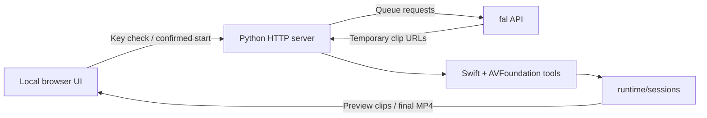

# Architecture

FrameCurrent is intentionally small: a standard-library Python server, a vanilla HTML/CSS/JavaScript client, and three Swift/AVFoundation media helpers.

## Paid generation path

1. The browser validates the persistent creation fields; cost and paid-confirmation controls are not kept in the main form.
2. Clicking start opens one confirmation dialog. Fixed-duration mode uses the local cost estimate; unlimited mode asks for a temporary local estimated-cost cap inside the dialog.
3. Canceling closes the dialog without starting. Confirming sends `paid_confirmed: true`, the selected maximum budget and a client-generated UUID for idempotency.
4. The server independently validates paid confirmation, duration, aspect ratio, provider URLs and budget exactly as before.
5. The first clip uses text-to-video, or image-to-video for a custom-channel reference image.
6. Each subsequent clip uses the previous validated final frame and continuity constraints.
7. Clips are downloaded, inspected, trimmed to planned duration and appended to the manifest.
8. The finalizer re-encodes a unified H.264 MP4 and AAC track, then records size and SHA-256.

## Trust boundaries

- Browser storage is local but not secret storage.
- The Python process temporarily holds the provider Key.
- fal processes prompts, references, end frames, and generated media.
- `runtime/` is durable local content and may contain sensitive creative work.
- The HTTP service enforces loopback binding plus Host, Origin and JSON request checks, but it has no public authentication and is safe only on loopback.
- Authenticated provider requests and media downloads reject redirects instead of forwarding credentials or crossing trust boundaries.
- The estimated-cost cap is a local submission guard based on built-in reference rates, not a provider billing guarantee.

## Product evidence levels

FrameCurrent keeps these claims separate:

- **Configured**: a channel and budget were selected.
- **Submitted**: the provider accepted a job.
- **Generated**: a clip was returned.
- **Validated**: the local media structure passed checks.
- **Merged**: a final file was created and hashed.
- **Accepted**: a person watched the complete relevant video and approved motion/story continuity.
